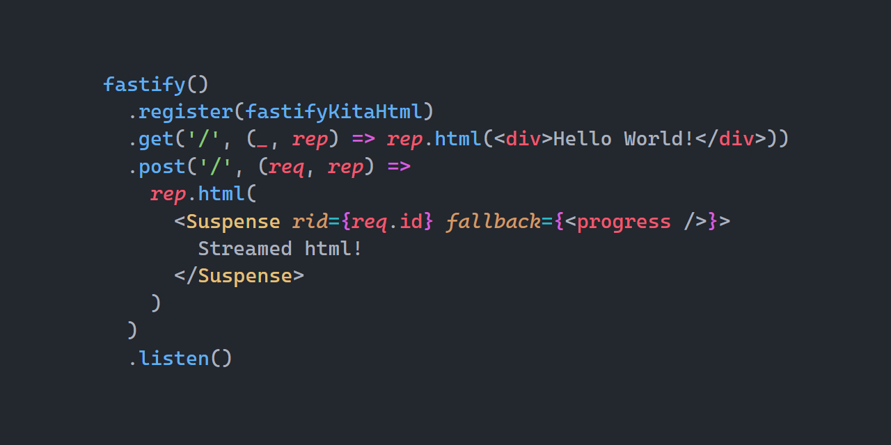

<p align="center">
   <b>Using this package?</b> Please consider <a href="https://github.com/sponsors/arthurfiorette" target="_blank">donating</a> to support my open source work ❤️
  <br />
  <sup>
   Help @kitajs/fastify-html-plugin grow! Star and share this amazing repository with your friends and co-workers!
  </sup>
</p>

<br />

<p align="center" >
  <a href="https://kitajs.org" target="_blank" rel="noopener noreferrer">
    
  </a>
</p>

<br />

<div align="center">
  <a href="https://kitajs.org/discord"></a>
  <a title="MIT license" target="_blank" href="https://github.com/kitajs/html/blob/master/LICENSE"></a>
  <a title="Codecov" target="_blank" href="https://app.codecov.io/gh/kitajs/html"></a>
  <a title="NPM Package" target="_blank" href="https://www.npmjs.com/package/@kitajs/fastify-html-plugin"></a>
  <a title="Bundle size" target="_blank" href="https://bundlephobia.com/package/@kitajs/fastify-html-plugin@latest"></a>
  <a title="Last Commit" target="_blank" href="https://github.com/kitajs/html/commits/master"></a>
  <a href="https://github.com/kitajs/html/stargazers"></a>
</div>

<br />
<br />

<h1>🖨️ Fastify KitaJS Html Plugin</h1>

<p align="center">
  <code>@kitajs/fastify-html-plugin</code> is a fastify plugin to seamlessly integrate the KitaJS Html JSX engine into your fastify application.
  <br />
  <br />
</p>

<br />

- [Installing](#installing)
- [Preview](#preview)
- [Installing](#installing-1)
- [Configuration](#configuration)
- [Documentation](#documentation)
- [API](#api)
  - [`reply.html()`](#replyhtml)
- [License](#license)

<br />
<br />

## Installing

```sh
npm install @kitajs/fastify-html-plugin
```

<br />

## Preview



<br />

## Installing

> [!CAUTION]  
> You **must have followed the `@kitajs/html`'s
> [Installing](https://github.com/kitajs/html/tree/master/packages/html#installing)
> guide** before continuing, otherwise you will be vulnerable to XSS attacks.

```ts
import kitaHtmlPlugin from '@kitajs/fastify-html-plugin';
import fastify from 'fastify';

const app = fastify();

app.register(kitaHtmlPlugin);
```

## Configuration

Every option is well documented through their respective JSDoc comments, below are the
default options.

| Name          | Description                                                                                        | Default |
| ------------- | -------------------------------------------------------------------------------------------------- | ------- |
| `autoDoctype` | Whether to automatically add `<!doctype html>` to a response starting with `<html>`, if not found. | `true`  |

<br />

## Documentation

`@kitajs/html` is a `JSX` -> `string` runtime, this package seamlessly integrates with
`fastify` to improve the developer experience while also providing faster implementations
for this use case.

- Read [`@kitajs/html` documentation](https://github.com/kitajs/html) for help with
  templating, and all other stuff related to `<jsx />`.
- Read
  [`@kitajs/ts-html-plugin` documentation.](https://github.com/kitajs/html/tree/master/packages/ts-html-plugin)
  for help setting up the **XSS** detector and IDE intellisense.

<br />

## API

### `reply.html()`

Sends the html to the browser. This method supports all types of components, including
`<Suspense />` and `<ErrorBoundary />`.

The entire component tree will be awaited before being sent to the browser as a single
piece.

When Suspense components are found, their fallback will be synchronously awaited and sent
to the browser in the original stream, as its children are resolved, new pieces of html
will be sent to the browser. When all `Suspense`s pending promises are resolved, the
connection is closed normally.

> [!NOTE]  
> `req.id` must be used as the `Suspense`'s `rid` parameter

If the HTML does not start with a doctype and `opts.autoDoctype` is enabled, it will be
added automatically. The correct `Content-Type` header will also be defined.

```tsx
app
  .get('/html', (req, reply) =>
    reply.html(
      <html lang="en">
        <body>
          <h1>Hello, world!</h1>
        </body>
      </html>
    )
  )
  .get('/stream', (req, reply) =>
    reply.html(
      <Suspense rid={req.id} fallback={<div>Loading...</div>}>
        <MyAsyncComponent />
      </Suspense>
    )
  );
```

<br />

## License

Licensed under the **MIT**. See [`LICENSE`](LICENSE) for more informations.

<br />
