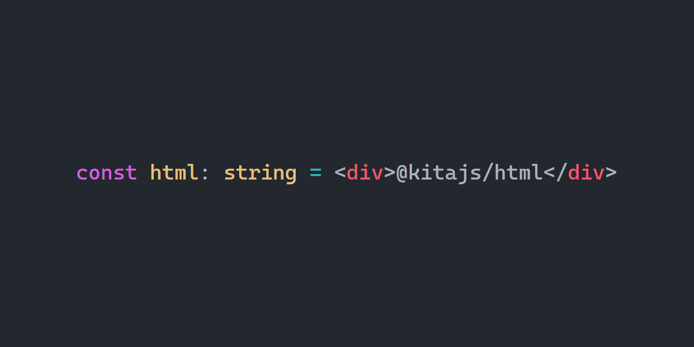

<p align="center">
   <b>Using this package?</b> Please consider <a href="https://github.com/sponsors/arthurfiorette" target="_blank">donating</a> to support my open source work ❤️
  <br />
  <sup>
   Help @kitajs/html grow! Star and share this amazing repository with your friends and co-workers!
  </sup>
</p>

<br />

<p align="center" >
  <a href="https://kita.js.org" target="_blank" rel="noopener noreferrer">
    
  </a>
</p>

<br />

<div align="center">
  <a title="MIT license" target="_blank" href="https://github.com/kitajs/html/blob/master/LICENSE"></a>
  <a title="Codecov" target="_blank" href="https://app.codecov.io/gh/kitajs/html"></a>
  <a title="NPM Package" target="_blank" href="https://www.npmjs.com/package/@kitajs/html"></a>
  <a title="Bundle size" target="_blank" href="https://bundlephobia.com/package/@kitajs/html@latest"></a>
  <a title="Last Commit" target="_blank" href="https://github.com/kitajs/html/commits/master"></a>
  <a href="https://github.com/kitajs/html/stargazers"></a>
</div>

<br />
<br />

<h1>🏛️ KitaJS Html</h1>

<p align="center">
  <code>@kitajs/html</code> is a <a href="#performance">super fast</a> JSX runtime to generate HTML strings that works everywhere. 
   <br /><i><a href="https://expressjs.com">Express</a>? <a href="https://fastify.dev">Fastify</a>? <a href="https://hono.dev">Hono</a>? <a href="https://bun.sh">Bun</a>? <a href="https://htmx.org/">Htmx</a>?</i>
   <br /><br /><b>If your code works with strings, we got you covered.</b>
  <br />
  <br />
</p>

<br />

- [Preview](#preview)
- [Installing](#installing)
- [Getting Started](#getting-started)
- [Sanitization](#sanitization)
  - [The Safe Attribute](#the-safe-attribute)
- [Editor Intellisense and CLI tool](#editor-intellisense-and-cli-tool)
- [Async Components](#async-components)
  - [Suspense component](#suspense-component)
  - [Error boundaries](#error-boundaries)
  - [Why JSX.Element is a Promise?](#why-jsxelement-is-a-promise)
  - [Why there is no `context` API?](#why-there-is-no-context-api)
- [Alternative way to configure your tsconfig](#alternative-way-to-configure-your-tsconfig)
- [Migrating from HTML](#migrating-from-html)
  - [Htmx](#htmx)
  - [Alpinejs](#alpinejs)
  - [Hotwire Turbo](#hotwire-turbo)
  - [Base HTML templates](#base-html-templates)
- [Compiling HTML](#compiling-html)
  - [Clean Components](#clean-components)
- [Fragments](#fragments)
- [Supported HTML](#supported-html)
  - [The `tag` tag](#the-tag-tag)
  - [Conditional classes](#conditional-classes)
- [Extending types](#extending-types)
  - [Allow everything!](#allow-everything)
- [Performance](#performance)
- [How it works](#how-it-works)
- [Serialization table](#serialization-table)
- [Format HTML output](#format-html-output)
- [Deprecating global register](#deprecating-global-register)
- [Fork credits](#fork-credits)

<br />
<br />

## Preview



<br />

## Installing

To use the `@kitajs/html` package, follow these steps:

1. Install the required npm packages, `@kitajs/html` and `@kitajs/ts-html-plugin`, to
   enable editor intellisense. Open your terminal and run:

   ```sh
   npm install @kitajs/html @kitajs/ts-html-plugin
   ```

2. Configure your TypeScript project to transpile TSX/JSX into JavaScript and using our
   [LSP Plugin](#editor-intellisense-and-cli-tool). Update your `tsconfig.json` file with
   the following settings:

   ```jsonc
   // tsconfig.json

   {
     "compilerOptions": {
       "jsx": "react-jsx",
       "jsxImportSource": "@kitajs/html",
       "plugins": [{ "name": "@kitajs/ts-html-plugin" }]
     }
   }
   ```

3. Append the
   [`xss-scan`](https://github.com/kitajs/html/tree/master/packages/ts-html-plugin/tree/main#running-as-cli)
   command into your test script. This CLI comes from @kitajs/ts-html-plugin, which
   catches XSS vulnerabilities that may be introduced into your codebase, automating the
   xss scanning process to run everytime you test your code, like inside your CI/CD
   environment. Open your `package.json` file and add the following script:

   ```jsonc
   // package.json

   {
     "scripts": {
       "test": "xss-scan"
     }
   }
   ```

4. Ensure that your code editor is using the TypeScript version from your project's
   `node_modules` instead of the globally installed TypeScript. For Visual Studio Code,
   you can configure this in your workspace settings:

   ```jsonc
   // .vscode/settings.json

   {
     "typescript.tsdk": "node_modules/typescript/lib"
   }
   ```

<br />
<br />
<br />

> [!CAUTION]
>
> # Be sure your setup is working correclty!
>
> Try writing `console.log(<div>{String.name}</div>);` in your editor. If it **THROWS** a
> `XSS` error, then your setup is correct. Refer to the
> [@kitajs/ts-html-plugin](https://github.com/kitajs/html/tree/master/packages/ts-html-plugin)
> repository for more details on setting up editor intellisense. _(It should throw, as
> `String.name` has a type of `string`, type which may or may not have special caracters)_

<br />
<br />
<br />

## Getting Started

After installing the `@kitajs/html` package and configuring your TypeScript project, you
should be able to use JSX to generate HTML inside your .tsx files.

```tsx
const html = (
  <div>
    <h1>Hello, world!</h1>
    <p>Welcome to the KitaJS HTML package.</p>
  </div>
);
```

Always use the `safe` attribute or manually call `Html.escapeHtml` to protect against XSS
vulnerabilities when rendering user input.

Ensuring XSS prevention is vital to guarantee your application's security. You can employ
the
[`@kitajs/ts-html-plugin`](https://github.com/kitajs/html/tree/master/packages/ts-html-plugin)
to catch XSS issues in your code editor and enhance your code's security.

<br />

## Sanitization

<br />

> [!IMPORTANT]  
> Please utilize our `@kitajs/ts-html-plugin` to emit TypeScript errors wherever you are
> exposed to XSS. Refer to [Getting Started](#getting-started) for installation
> instructions.

<br />

This package sanitizes every attribute by default. However, since the resulting element is
always a string, it's impossible to differentiate an HTML element created by a `<tag>` or
from user input. This necessitates the use of the provided [`safe`](#the-safe-attribute)
or manual invocation of `Html.escapeHtml`. Or you can also use the `Html.escape` or its
alias `e` template function.

```tsx
import { e } from '@kitajs/html';

<div>⚠️ This will NOT be escaped and WILL expose you to XSS</div>

<div attr="This WILL be escaped"></div>
<div safe>This WILL be escaped</div>
<div>{Html.escapeHtml('This WILL be escaped')}</div>
<div>{e`This WILL be escaped: ${someVar}`}</div>
```

Here's an example of how this is **DANGEROUS** for your application:

```tsx
user = {
  name: 'Bad guy',
  description: '</div><script>getStoredPasswordAndSentToBadGuysServer()</script>'
};

// Executes malicious code:
input = <div class="user-card">{user.description}</div>;
output = (
  <div class="user-card">
    <script>getStoredPasswordAndSentToBadGuysServer()</script>
  </div>
);

// Does not execute any malicious code:
input = (
  <div class="user-card" safe>
    {user.description}
  </div>
);
output = (
  <div class="user-card">
    &lt;/div&gt;&lt;script&gt;getStoredPasswordAndSentToBadGuysServer()&lt;/script&gt;
  </div>
);
```

<br />

### The Safe Attribute

Always use the `safe` attribute when rendering uncontrolled user input. This will sanitize
the contents and prevent XSS attacks.

```tsx
function UserCard({ name, description, date, about }) {
  return (
    <div class="card">
      <h1 safe>{name}</h1>
      <br />
      <p safe>{description}</p>
      <br />
      // Controlled input, no need to sanitize
      <time datetime={date.toISOString()}>{date.toDateString()}</time>
      <br />
      <p safe>{about}</p>
    </div>
  );
}
```

Note that you should only use the `safe` attribute at the very bottom of the HTML tree
where it's needed.

<br />

## Editor Intellisense and CLI tool

<p align="center">
  
</p>

<h2>⚠️</h2>

**Note:** This section has been relocated to the
[@kitajs/ts-html-plugin](https://github.com/kitajs/html/tree/master/packages/ts-html-plugin)
repository.

Please consult their
"[Getting Started](https://github.com/kitajs/html/tree/master/packages/ts-html-plugin#getting-started)"
section for instructions on enabling editor IntelliSense and using the CLI tool.

<br />
<br />
<br />
<br />

## Async Components

Async components are supported. When any child or sub child of a component tree is a
promise, the whole tree will return a promise of the html string.

If no async components are found, the result will be simply a string, and you can safely
cast it into a string.

```tsx
async function Async() {
  await callApi();
  return <div>Async!</div>;
}

function Sync() {
  return <div>Sync!</div>;
}

const async = (
  <div>
    <Async />
  </div>
);

async instanceof Promise;

const sync: string = (
  <div>
    <Sync />
  </div>
);

typeof sync === 'string';
```

A `JSX.Element` will always be a string. Once a children element is a async component, the
entire upper tree will also be async.
[Learn when JSX.Element is a Promise](#why-jsxelement-is-a-promise).

<br />

### Suspense component

The only problem when rendering templates is that you must wait for the whole template to
be rendered before sending it to the client. This is not a problem for small templates,
but it can be a problem for large templates.

To solve this problem, we provide a `Suspense` component that combined with
`renderToStream()` rendering method, will stream a fallback component while it waits for
his children to be rendered. This is a perfect combo to use with
[async components](#async-components).

```tsx
import { Suspense, renderToStream } from '@kitajs/html/suspense';

async function MyAsyncComponent() {
  const data = await database.query();
  return <User name={data.username} />;
}

function renderUserPage(rid: number) {
  return (
    <Suspense
      rid={rid}
      fallback={<div>Loading username...</div>}
      catch={(err) => <div>Error: {err.stack}</div>}
    >
      <MyAsyncComponent />
    </Suspense>
  );
}

// Html is a string readable stream that can be piped to the client
const html = renderToStream(renderUserPage);
```

<br />

> [!NOTE]  
> The `renderToStream()` is returns a native node/bun stream, head over to our
> [suspense-server](examples/suspense-server.tsx) example to see how to use it with
> node:http, Express or Fastify servers.

<br />

The above example would render `<div>Loading username...</div>` while waiting for the
`MyAsyncComponent` to be rendered.

When using `Suspense`, you cannot just call the component and get the html string, you
need to use the `renderToStream` function to get a stream that can be piped to the client
with updates. Otherwise, the fallback would render forever.

As the result of any JSX component is always a string, you must use the `rid` provided by
`renderToStream` into all your suspense components, this way we can identify which
suspense is for which request and be able to render concurrent requests.

Suspense also accepts async fallbacks, but it blocks rendering until the fallback is
resolved.

```tsx
function renderTemplate(rid: number) {
  return (
    <Suspense
      rid={rid}
      fallback={<MyAsyncFallback />}
      catch={(err) => <div>Error: {err.stack}</div>}
    >
      <MyAsyncComponent />
    </Suspense>
  );
}
```

The above example would only return anything after `MyAsyncFallback` is resolved. To catch
async fallback errors, you must wrap it into a [`ErrorBoundary`](#error-boundaries).

<br />

### Error boundaries

The same way as promises must be awaited to resolve its own html, errors must be caught.
Outside of suspense components, you can use the provided error boundaries to catch errors.

```tsx
import { ErrorBoundary } from '@kitajs/html/error-boundary';

async function MyAsyncComponent() {
  const data = await database.query(); // this promise may reject
  return <User name={data.username} />;
}

function renderTemplate() {
  return (
    <ErrorBoundary catch={(err) => <div>Error: {err.stack}</div>}>
      <MyAsyncComponent />
    </ErrorBoundary>
  );
}

// If MyAsyncComponent throws an error, it will render <div>Error: ...</div>
const html = await renderTemplate();
```

Error boundaries will only work for errors thrown inside async components, for sync
components you must use try/catch.

```tsx
function MySyncComponent() {
  try {
    const data = database.query(); // this may throw an error
    return <User name={data.username} />;
  } catch (err) {
    return <div>Error: {err.stack}</div>;
  }
}
```

Error boundaries outside suspense components will only catch errors thrown by the fallback
component. You must use the Suspense's `catch` property to handle errors thrown by its
children components.

```tsx
function renderTemplate(rid: number) {
  return (
    <ErrorBoundary catch={<div>fallback error</div>}>
      <Suspense
        rid={rid}
        fallback={<MyAsyncFallback />}
        catch={<div>Children error</div>}
      >
        <MyAsyncComponent />
      </Suspense>
    </ErrorBoundary>
  );
}

const html = renderToStream(renderTemplate);
```

The above example would render `<div>Children error</div>` if `MyAsyncComponent` throws an
error, or `<div>fallback error</div>` if `MyAsyncFallback` throws an error. If both throws
an error, the first error will be changed to the second error as soon as the children
error is thrown.

<br />

### Why JSX.Element is a Promise?

<br />

> [!NOTE]  
> Until [#14729](https://github.com/microsoft/TypeScript/issues/14729) gets implemented,
> you need to manually cast `JSX.Element` into strings if you are sure there is no inner
> async components in your component tree.

<br />

JSX elements are mostly strings everywhere. However, as the nature of this package, once a
children element is a async component, the entire upper tree will also be async. Unless
you are sure that no other component in your entire codebase is async, you should always
handle both string and promise cases.

```tsx
// It may or may not have inner async components.
const html = <Layout />;

if (html instanceof Promise) {
  // I'm a promise, I should be awaited
  console.log(await html);
} else {
  // I'm a string, I can be used as is
  console.log(html);
}
```

<br />

### Why there is no `context` API?

We choose to not provide a `context` API. Here the reasons why:

This library only outputs strings (or Promises that resolve to strings), we don't manage
lifecycle or state. So the main selling point to having a `context` API is to avoid
[prop drilling](https://www.geeksforgeeks.org/what-is-prop-drilling-and-how-to-avoid-it).

A context Api would need to use a request identifier (internally called `rid`) to be safe
to access asynchronously. Take for example two requests that are being processed at the
same time, both of them use some async components. If we use a global context without
scoping it behind some sort of `rid`, the second request would override the context of the
first request. So for the first request, some part of the rendering (the non async part)
would use the correct context, but then the other section inside the async component would
use the context of the second request. **This is bad.**. Each component that uses context
would need to receive the `rid` as a prop. This will defeat the purpose of having a
context in the first place. The `rid` is needed to make the context async safe.

The only way to maintain data consistency across concurrent renders without attaching a
request locator (`rid`), is by using
[ALS](https://nodejs.org/api/async_context.html#class-asynclocalstorage). However, this
approach introduces a lot of overhead and a significant performance penalty.

Our recommendation is to use props. If you want to avoid prop drilling, you can use a
composition style of writing components. This is a common pattern in other JSX-based
libraries, and it works well with this library too.

```tsx
// Drills only the required properties.
app.get('/', (request, response) => (
  <YourDoctype title="Home">
    <YourLayout loggedIn={!!request.user} lang={request.headers['accept-language']}>
      <YourNavbar user={request.user} />
      <YourContent />
      <YourSubMenu path={request.url} username={request.user?.name} />
    </YourLayout>
  </YourDoctype>
));
```

</br>

## Alternative way to configure your tsconfig

Is it possible to use this library using the old `jsx` and `jsxFactory` options in your
`tsconfig.json` file. This is not recommended, but it is possible.

```json
{
  "compilerOptions": {
    "jsx": "react",
    "jsxFactory": "Html.createElement",
    "jsxFragmentFactory": "Html.Fragment"
  }
}
```

If you choose this approach keep in mind that you will need to manually import the `Html`
namespace in every file you use JSX.

```tsx
import { Html } from '@kitajs/html';

const Html = (
  <div>
    <h1>Hello, world!</h1>
    <p>Welcome to the KitaJS HTML package.</p>
  </div>
);
```

And also there is a light performance penalty when using this approach. It's minimal, but
it's there.

## Migrating from HTML

Migrating from plain HTML to JSX can be a pain to convert it all manually, as you will
find yourself hand placing quotes and closing void elements.

You can use [**Html To Jsx**](https://magic.reactjs.net/htmltojsx.htm).

```html
<!-- Hello world -->
<div class="awesome" style="border: 1px solid red">
  <label for="name">Enter your name: </label>
  <input type="text" id="name" />
</div>
<p>Enter your HTML here</p>
```

Results into:

```tsx
<>
  {/* Hello world */}
  <div className="awesome" style={{ border: '1px solid red' }}>
    <label htmlFor="name">Enter your name: </label>
    <input type="text" id="name" />
  </div>
  <p>Enter your HTML here</p>
</>
```

<br />

### Htmx

The usage of [htmx.org](https://htmx.org/) is super common with this project, this is why
we also provide type definitions for all HTMX attributes.

You just need to add this triple slash directive to the top of your file:

```tsx
/// <reference types="@kitajs/html/htmx.d.ts" />

const html = (
  // Type checking and intellisense for all HTMX attributes
  <div hx-get="/api" hx-trigger="click" hx-target="#target">
    Click me!
  </div>
);
```

Or you can use the type option in your tsconfig to import the types globally:

```json
{
  "compilerOptions": {
    "types": ["@kitajs/html/htmx.d.ts"]
  }
}
```

<br />

### Alpinejs

[Alpinejs](https://alpinejs.dev/) is commonly used with htmx.

You just need to add this triple slash directive to the top of your file:

```tsx
/// <reference types="@kitajs/html/alpine.d.ts" />

const html = (
  // Type checking and intellisense for all HTMX attributes
  <div x-data="{ open: false }">...</div>
);
```

Or you can use the type option in your tsconfig to import the types globally:

```json
{
  "compilerOptions": {
    "types": ["@kitajs/html/alpine.d.ts"]
  }
}
```

<br />

### Hotwire Turbo

This project supports the usage of [Turbo Hotwire](https://turbo.hotwired.dev/). We
provide a separate export that you can use to provide type definitions for the elements
and attributes used with Turbo Hotwire.

You just need to add this triple slash directive to the top of your file:

```tsx
/// <reference types="@kitajs/html/hotwire-turbo.d.ts" />

const html = (
  // Type checking and intellisense for all HTMX attributes
  <turbo-frame id="messages">
    <a href="/messages/expanded">Show all expanded messages in this frame.</a>

    <form action="/messages">Show response from this form within this frame.</form>
  </turbo-frame>
);
```

Or you can use the type option in your tsconfig to import the types globally:

```json
{
  "compilerOptions": {
    "types": ["@kitajs/html/hotwire-turbo.d.ts"]
  }
}
```

<br />

### Base HTML templates

Often you will have a "template" html with doctype, things on the head, body and so on...
Most users try to use them as a raw string and only use JSX for other components, but this
is a not a good idea as
[you will have problems with it](https://github.com/nicojs/typed-html/issues/46).

But you can always concatenate strings, like in this required use-case for `<doctype>`

```tsx
export function Layout(props: Html.PropsWithChildren<{ head: string; title?: string }>) {
  return (
    <>
      {'<!doctype html>'}
      <html lang="en">
        <head>
          <meta charset="UTF-8" />
          <meta name="viewport" content="width=device-width, initial-scale=1.0" />
          <title>{props.title || 'Hello World!'}</title>
          {props.head}
        </head>
        <body>{props.children}</body>
      </html>
    </>
  );
}

const html = (
  <Layout
    head={
      <>
        <link rel="stylesheet" href="/style.css" />
        <script src="/script.js" />
      </>
    }
  >
    <div>Hello World</div>
  </Layout>
);
```

<br />

## Compiling HTML

`Html.compile` interface compiles a [clean component](#clean-components) into a super fast
component. This does not support unclean components / props processing.

<br />

> [!WARNING]  
> This feature is a special use case for rendering **entire page templates** like what you
> would do with handlebars or nunjucks.
>
> It does not works with mostly JSX components and, for small components,
> [it will be slower than the normal](benchmark.md) JSX syntax.

<br />

This mode works just like prepared statements in SQL. Compiled components can give up to
[**2000**](#performance) times faster html generation. This is a opt-in feature that you
may not be able to use everywhere!

Due to the nature of
[`Proxy`](https://developer.mozilla.org/en-US/docs/Web/JavaScript/Reference/Global_Objects/Proxy)
objects, the spread operator (`...`) will not work with compiled components. You need to
manually pass all props to their components.

```tsx
import Html from '@kitajs/html';

function Component(props: Html.PropsWithChildren<{ name: string }>) {
  return <div>Hello {props.name}</div>;
}

const compiled = Html.compile<typeof Component>(Component);

compiled({ name: 'World' });
// <div>Hello World</div>

const compiled = Html.compile((p) => <div>Hello {p.name}</div>);

compiled({ name: 'World' });
// <div>Hello World</div>
```

Properties passed for compiled components **ARE NOT** what will be passed as argument to
the generated function.

```tsx
const compiled = Html.compile((t) => {
  // THIS WILL NOT print 123, but a string used by .compile instead
  console.log(t.asd);
  return <div></div>;
});

compiled({ asd: 123 });
```

That's the reason on why you cannot compile unclean components, as they need to process
the props before rendering.

<br />

### Clean Components

A **clean component** is a component that does not process props before applying them to
the element. This means that the props are applied to the element as is, and you need to
process them before passing them to the component.

```tsx
// Clean component, render as is
function Clean(props: PropsWithChildren<{ sum: number }>) {
  return <div>{props.sum}</div>;
}

// Calculation is done before passing to the component
html = <Clean sum={3 * 2} />;

// Unclean component, process before render
function Unclean(props: { a: number; b: number }) {
  return <div>{props.a * props.b}</div>;
}

// Calculation is done inside the component, thus cannot be used with .compile()
html = <Unclean a={3} b={2} />;
```

<br />

## Fragments

JSX does not allow multiple root elements, but you can use a fragment to group multiple
elements:

```tsx
const html = (
  <>
    <div>1</div>
    <div>2</div>
  </>
);
```

[Learn more about JSX syntax here!](https://react.dev/learn/writing-markup-with-jsx)

<br />

## Supported HTML

All HTML elements and attributes should be supported.

- [Supported html elements](https://html.spec.whatwg.org/multipage#toc-semantics)
- [Supported html events](https://www.w3schools.com/tags/ref_eventattributes.asp)

**Missing an element or attribute?** Please create an issue or a PR to add it. It's easy
to add.

<br />

### The `tag` tag

The `<tag of="">` tag is a custom internal tag that allows you to render any runtime
selected tag you want. Possibly reasons to prefer this tag over extending types:

- You want to render a tag that is chosen at runtime.
- You don't want to mess up with extending globally available types.
- You are writing javascript with typechecking enabled.
- You are writing a library and should not extend types globally.
- You need to use kebab-case tags, which JSX syntax does not support.

```tsx
<tag of="asd" />
// <asd></asd>

<tag of="my-custom-KEBAB" />
// <my-custom-KEBAB></my-custom-KEBAB>
```

We do recommend using [extending types](#extending-types) instead, as it will give you
intellisense and type checking.

<br />

### Conditional classes

Kita supports constructing `class` attributes conditionally, which is a common use case
for many applications.

```tsx
<div class={['a', true && 'b', false && 'c', 'd']} />
// <div class="a b d"></div>

<div class={['class-a class-b', true && 'class-c']} />
// <div class="class-a class-b class-c"></div>
```

This behavior is pretty similar and inspired from [clsx](https://github.com/lukeed/clsx),
but we do not support objects as input.

<br />

## Extending types

Just as exemplified above, you may also want to add custom properties to your elements.
You can do this by extending the `JSX` namespace.

```tsx
declare global {
  namespace JSX {
    // Adds a new element called mathPower
    interface IntrinsicElements {
      mathPower: HtmlTag & {
        // Changes properties to the math-power element
        ['my-exponential']: number;
        // this property becomes the <>{children}</> type
        children: number;
      };
    }

    // Adds hxBoost property to all elements native elements (those who extends HtmlTag)
    interface HtmlTag {
      ['hx-boost']: boolean;
      // TIP: We already provide HTMX types, check them out!
    }
  }
}

const element = (
  <mathPower my-exponential={2} hx-boost>
    {3}
  </mathPower>
);
// Becomes <math-power my-exponential="2" hx-boost>3</math-power>
```

### Allow everything!

We also provide a way to allow any tag/attribute combination, altough we **do not
recommend using it**.

Just add this triple slash directive to the top of your file:

```html
/// <reference types="@kitajs/html/all-types.d.ts" />
```

<br />

## Performance

This package is just a string builder on steroids, as you can see
[how this works](#how-it-works). This means that most way to isolate performance
differences is to micro benchmark.

The below benchmark compares this package with other popular HTML builders, like React,
Typed Html, Common Tags and GHtml.

You can run this yourself by running `pnpm bench`.

> [!NOTE]  
> This benchmark aims to represent real world usage, any tagged template library (like
> [ghtml](https://www.npmjs.com/package/ghtml)) will outperform any JSX library (like this
> one) when rendering a entire template within a single `html'<div>...</div>'` call.

```
cpu: 13th Gen Intel(R) Core(TM) i5-13600K
runtime: node v20.11.0 (x64-linux)

benchmark        time (avg)             (min … max)       p75       p99      p999
--------------------------------------------------- -----------------------------
• Many Components (31.4kb)
--------------------------------------------------- -----------------------------
KitaJS/Html  98'860 ns/iter    (76'287 ns … 448 µs) 97'481 ns    238 µs    410 µs
Typed Html      738 µs/iter     (635 µs … 1'398 µs)    779 µs  1'118 µs  1'398 µs
React         4'119 µs/iter   (3'871 µs … 4'775 µs)  4'210 µs  4'755 µs  4'775 µs
Common Tags   2'815 µs/iter   (2'565 µs … 3'461 µs)  2'905 µs  3'414 µs  3'461 µs
Ghtml           753 µs/iter     (654 µs … 1'358 µs)    773 µs  1'080 µs  1'358 µs

summary for Many Components (31.4kb)
  KitaJS/Html
   7.46x faster than Typed Html
   7.61x faster than Ghtml
   28.47x faster than Common Tags
   41.66x faster than React

• Many Props (7.4kb)
--------------------------------------------------- -----------------------------
KitaJS/Html  18'628 ns/iter    (15'527 ns … 515 µs) 16'945 ns 60'084 ns    218 µs
Typed Html   76'473 ns/iter    (65'986 ns … 509 µs) 70'509 ns    225 µs    379 µs
React        71'436 ns/iter    (56'823 ns … 805 µs) 65'783 ns    272 µs    482 µs
Common Tags  43'080 ns/iter    (36'634 ns … 594 µs) 39'846 ns    125 µs    357 µs
Ghtml        42'271 ns/iter    (37'753 ns … 511 µs) 39'867 ns    101 µs    319 µs

summary for Many Props (7.4kb)
  KitaJS/Html
   2.27x faster than Ghtml
   2.31x faster than Common Tags
   3.83x faster than React
   4.11x faster than Typed Html

• MdnHomepage (66.7Kb)
--------------------------------------------------- -----------------------------
KitaJS/Html  14'981 µs/iter (10'529 µs … 33'066 µs) 15'980 µs 33'066 µs 33'066 µs
Typed Html   28'667 µs/iter (25'501 µs … 36'842 µs) 30'385 µs 36'842 µs 36'842 µs
React        94'917 µs/iter    (85'455 µs … 108 ms)    105 ms    108 ms    108 ms
Common Tags  39'634 µs/iter (37'625 µs … 40'880 µs) 40'517 µs 40'880 µs 40'880 µs
Ghtml        37'052 µs/iter (33'344 µs … 41'569 µs) 39'852 µs 41'569 µs 41'569 µs

summary for MdnHomepage (66.7Kb)
  KitaJS/Html
   1.91x faster than Typed Html
   2.47x faster than Ghtml
   2.65x faster than Common Tags
   6.34x faster than React
```

<br />

## How it works

This package just aims to be a drop in replacement syntax for JSX, and it works because
you [tell tsc to transpile](#getting-started) JSX syntax to calls to our own JSX-runtime.

```tsx
<ol start={2}>
  {[1, 2].map((i) => (
    <li>{i}</li>
  ))}
</ol>
```

Gets transpiled by tsc to plain javascript:

```js
const runtime = require('@kitajs/html/jsx-runtime');

runtime.jsx('ol', {
  start: 2,
  children: [1, 2].map((i) => jsx('li', { children: i }))
});
```

Which, when called, returns this string:

```js
'<ol start="2"><li>1</li><li>2</li></ol>';
```

<br />

## Serialization table

Here is the table that explains how this library handles different types of children,
describing the inputs and outputs.

> [!IMPORTANT]  
> Arrays are simply concatenated with no separator.

| Input Type                 | Output Type           |
| -------------------------- | --------------------- |
| `<div>{"abc"}</div>`       | `<div>abc</div>`      |
| `<div>{10}</div>`          | `<div>10</div>`       |
| `<div>{NaN}</div>`         | `<div>NaN</div>`      |
| `<div>{Infinity}</div>`    | `<div>Infinity</div>` |
| `<div>{true}</div>`        | `<div>true</div>`     |
| `<div>{false}</div>`       | `<div>false</div>`    |
| `<div>{null}</div>`        | `<div></div>`         |
| `<div>{undefined}</div>`   | `<div></div>`         |
| `<div>{[1, 2, 3]}</div>`   | `<div>123</div>`      |
| `<div>{BigInt(123)}</div>` | `<div>123</div>`      |

<br />

## Format HTML output

This package emits HTML as a compact string, useful for over the wire environments.
However, if your use case really needs the output HTML to be pretty printed, you can use
an external JS library to do so, like
[html-prettify](https://www.npmjs.com/package/html-prettify).

```tsx
import prettify from 'html-prettify';

const html = (
  <div>
    <div>1</div>
    <div>2</div>
  </div>
);

console.log(html);
// <div><div>1</div><div>2</div></div>

console.log(prettify(html));
// <div>
//   <div>1</div>
//   <div>2</div>
// </div>
```

👉 There's an open PR to implement this feature natively, wanna work on it? Check
[this PR](https://github.com/kitajs/html/pull/1).

<br />

## Deprecating global register

The `@kitajs/html/register` import has been deprecated and will be removed in the next
major version. Please change the way you have configured your project to use this library.

Please update your tsconfig to use the new `jsxImportSource` option and remove all
references to `'@kitajs/html/register'` from your codebase.

```diff
{
  "compilerOptions": {
+   "jsx": "react-jsx",
+   "jsxImportSource": "@kitajs/html",
-   "jsx": "react",
-   "jsxFactory": "Html.createElement",
-   "jsxFragmentFactory": "Html.Fragment",
    "plugins": [{ "name": "@kitajs/ts-html-plugin" }],
  }
}
```

You can also remove all references to `import { Html } from '@kitajs/html'` from your
codebase.

```diff
- import { Html } from '@kitajs/html';
```

<br />

## Fork credits

This repository was initially forked from
[typed-html](https://github.com/nicojs/typed-html) and modified to add some features and
increase performance.

Initial credits to [nicojs](https://github.com/nicojs) and
[contributors](https://github.com/nicojs/typed-html/graphs/contributors) for the amazing
work.

Licensed under the [Apache License, Version 2.0](LICENSE).

<br />
